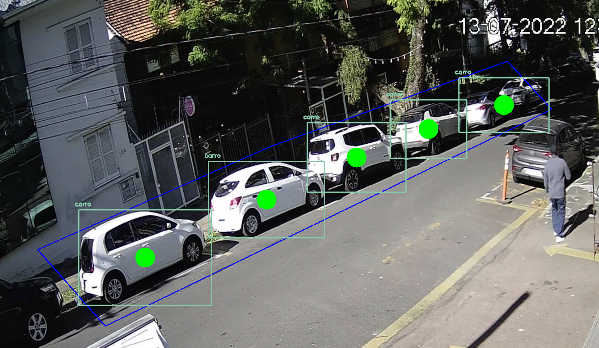
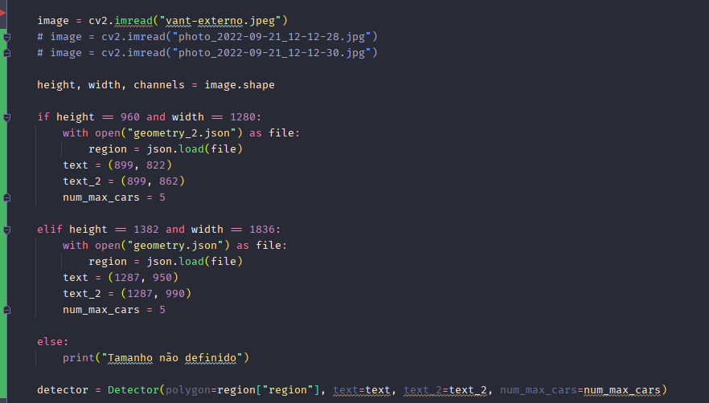

A proposta dessa pequeno projeto é, dado uma região de interesse, detectar os carros dentro dessa área conforme a imagem
abaixo.

Quando precisar mudar a imagem, é só ir no arquivo main.py e buscar a função image = cv2.imread("vant-externo.jpeg") dentro tem a imagem que você precisa mudar.

Caso precise mudar as coordenadas do poligon abra o arquivo geometry.json e lá há a chave chamada region, e dentro tem uma lista de pontos, em que cada ponto é uma lista sendo x e y os dados a serem trocados.

O primeiro e o ultimo ponto tem que ser o mesmo para fechar o poligono.

Para os poligonos que criei, fixei um valor para o valor de carros que cabem dentro dessa área, apenas para efeito de demonstração

Nesse trecho de código, os valores são fixos para essa demonstração 

caso precise mudar a imagem, coloquei 3 só comentar uma e descomentar a outra que o sistema fará o resto

